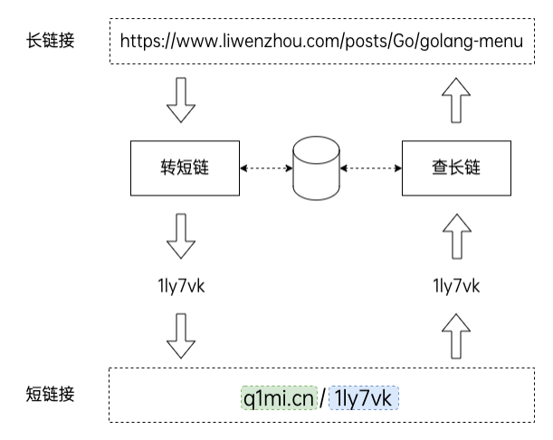

# ShortRoute

ShortRoute is a short URL service built with `go-zero`. It provides two core capabilities:

- convert a long URL into a short URL
- redirect a short URL back to the original target

The project focuses on a practical backend design with MySQL-based sequence generation, Redis-backed Bloom filter checks, and go-zero model/cache integration.

## Architecture

<p align="center">
  
</p>

The request flow is intentionally simple:

1. a long URL is submitted to the convert endpoint
2. the service validates the input and generates a short code
3. the mapping is stored in MySQL and indexed for lookup
4. the generated short URL is returned to the caller
5. later, visiting the short URL triggers a lookup and `302` redirect

## Tech Stack

- Go
- go-zero
- MySQL
- Redis
- Bloom Filter

## Features

- Base62 short code generation
- duplicate long URL detection by MD5
- blacklist protection for reserved short paths
- Redis Bloom filter to reduce invalid short-link lookups
- 302 redirect for short-link access

## Project Structure

```text
.
|-- etc/                  # example configuration
|-- image/                # project diagrams
|-- internal/
|   |-- config/           # config schema
|   |-- handler/          # HTTP handlers and routes
|   |-- logic/            # business logic
|   |-- svc/              # service context
|   `-- types/            # request / response types
|-- model/                # go-zero generated models
|-- pkg/                  # utility packages
|-- sequence/             # sequence generator abstraction
|-- sequence.sql          # sequence table schema
|-- short_url_map.sql     # short URL mapping table schema
`-- main.go               # application entrypoint
```

## API

### Create short URL

`POST /convert`

Request:

```json
{
  "longUrl": "https://example.com/article/123"
}
```

Response:

```json
{
  "shortUrl": "http://localhost:8888/abc123"
}
```

### Redirect by short URL

`GET /:shortUrl`

Example:

```text
GET /abc123
```

The service responds with `302 Found` and redirects to the original long URL.

## Quick Start

### 1. Prepare dependencies

- MySQL
- Redis

### 2. Create tables

Run the SQL scripts:

- `sequence.sql`
- `short_url_map.sql`

### 3. Update configuration

Edit the example config if needed:

- `etc/shortener-api.example.yaml`

You can keep using this file directly, or copy it to your own local config file and pass it with `-f`.

### 4. Run the service

```bash
go run .
```

Or specify a custom config file:

```bash
go run . -f etc/shortener-api.example.yaml
```

## Notes

- the current sequence generator uses MySQL auto-increment semantics
- short URL validation accepts reachable links and allows redirecting targets
- the repository intentionally excludes private local config files
- the framework diagram used in this README lives at `image/framework.png`

## Future Improvements

- add unit tests for handler / logic layers
- support custom short-code aliases
- add metrics and observability
- improve API error model
